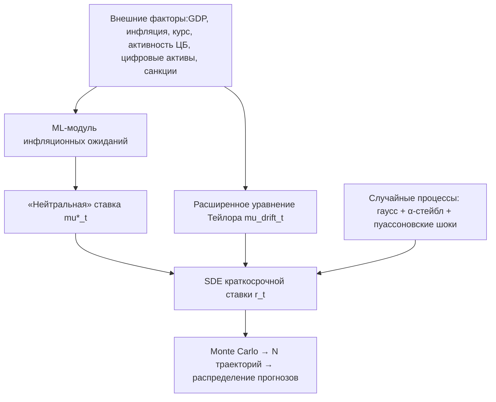

# Стохастическое моделирование процентных ставок на основе моделей ЦБ

Этот проект — продолжение и расширение текущей модели процентной ставки ЦБ РФ. Цель — дополнить классическую квартальную модель стохастическими оценками тяжёлых хвостов, чтобы повысить устойчивость прогнозов и сделать их пригодными для анализа экстремальных рисков. В дальнейшем результаты интеграции будут учтены при сценарном планировании и формировании монетарной стратегии.

**Основные задачи проекта:**

1. **Интеграция макро‑правил**
   • Сохранить и расширить правило Тейлора с учётом ключевых переменных: разрыв выпуска, инфляция, реальный курс.
   • Добавить цифровые активы и санкционные индикаторы в формулу дрифта.

2. **Моделирование «толстохвостых» шоков**
   • Ввести в динамику ставки две компоненты шума:
   – классический гауссовский процесс (дрейфовая часть модели Васичека/Кокса–Ингерсолла–Росса),
   – тяжёлохвостые импульсы через α‑стейбл‑распределение и пуассоновские скачки (чёрные лебеди, санкционные удары, всплески волатильности цифровых активов).

3. **Нейтральная ставка как стохастический процесс**
   Задать «рельефную» функцию нейтральной ставки μ\*(t) от инфляционных ожиданий:

   ```
   dμ*(t) = κ · (E_t[π] - π*) · dt + σ_μ · dW_μ(t)
   ```

   где `E_t[π]` — оценка инфляционных ожиданий ML‑модулем на основе макро‑ и альтернативных данных.

4. **Оптимизация параметров через ML**
   • Оценить коэффициенты правила Тейлора (касательные коэффициенты) нейросетевой регрессией на макро‑ и цифровых факторах.
   • Калибровать параметры стохастических процессов (волатильность, интенсивность скачков) методом максимального правдоподобия и вариационным выводом.

5. **Генерация распределений прогнозов**
   Запустить Monte Carlo‑симуляции SDE:

   ```
   dr(t) = [ f_Taylor(t) + β · (μ*(t) - r(t)) ] · dt
         + σ · dW(t) + γ · dJ(t)
   ```

   • Получить полные апостериорные распределения `{r(t+h)}` для каждого горизонта `h`.
   • Рассчитать интервальные прогнозы (VaR, CVaR), оценить CRPS и PIT‑диагностику, определить экстремальные квантили («хвостовые» риски).

## Архитектура решения



## Компоненты

1. **Сбор данных**
   – Официальные макро‑показатели ЦБ РФ: ВВП, инфляция, курс, кредитный импульс, бюджетные параметры.
   – Альтернативные данные: цифровая активность (chain‑analysis), санкционные индексы.

2. **ML‑модуль ожиданий инфляции**
   – RNN или Transformer обучаются на временных рядах и текстовой аналитике для оценки `E_t[π]`.

3. **Расширенное дрифтовое уравнение**

   ```
   f_Taylor(t) = α₀ + α₁ · (π(t) - π*) + α₂ · (y(t) - y*) + α₃ · ΔCA(t) + α₄ · S(t)
   ```

   где `CA` — цифровые активы, `S` — санкционные индикаторы.

4. **Комбинация случайных процессов**

   ```
   dW(t) ~ Normal(0, dt)
   dJ(t) = sum_{k=1}^{N(t)} ΔJ_k
   N(t) ~ Poisson(λ · dt),   ΔJ_k ~ α‑stable или Pareto
   ```

5. **Калибровка и оптимизация**
   – Adam-оптимизация для дрифта, Bayesian Optimization или VAE для стохастических параметров.
   – Bootstrap-блоки для доверительных интервалов параметров.

6. **Симуляции и анализ**
   – `N` Monte Carlo‑траекторий → эмпирические плотности.
   – Расчёт VaR, CVaR, CRPS, PIT.
   – Сенситивити-анализ по шокам и конфигурациям модели.


**Итог:**
ЦБ РФ получит адаптивную, сценарно-чувствительную модель краткосрочной процентной ставки, способную обрабатывать как умеренные изменения, так и хвостовые риски. Это обеспечит более надёжную поддержку денежно-кредитной политики в условиях неопределённости.
