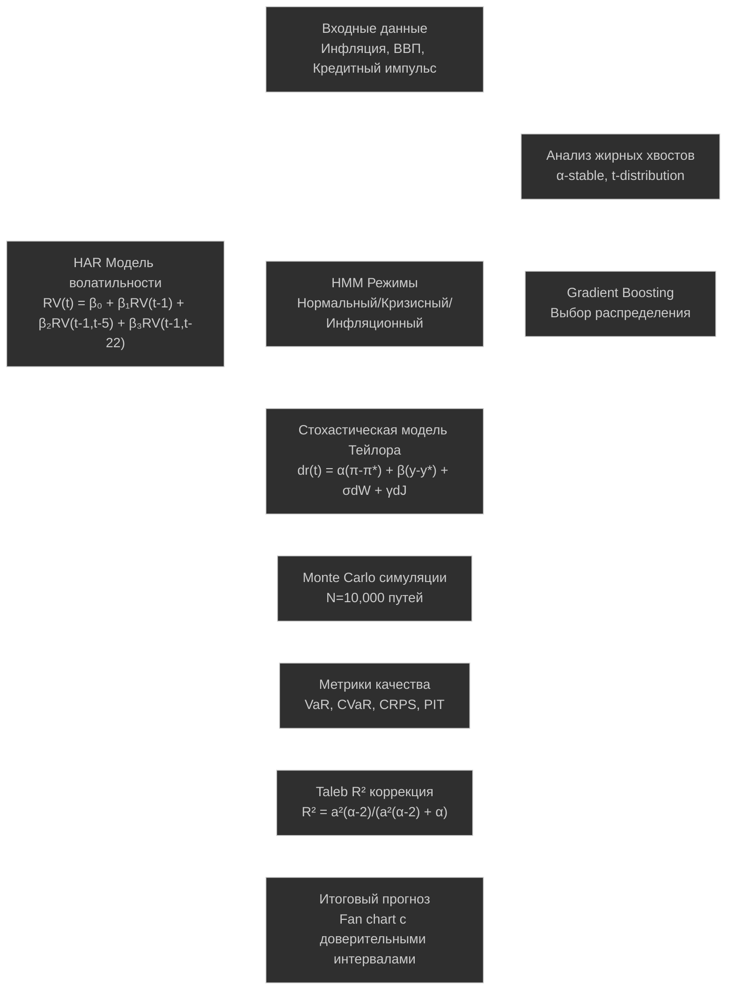
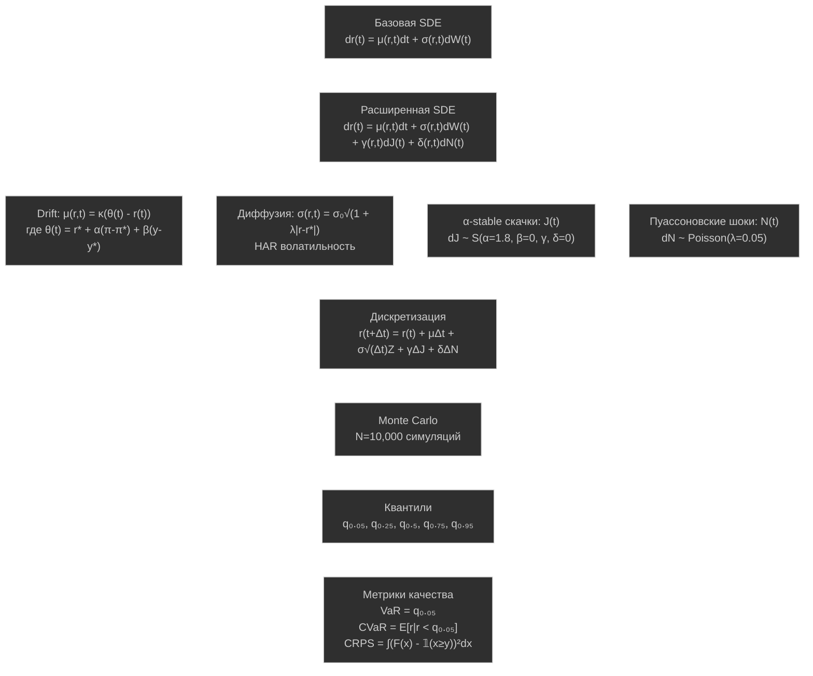
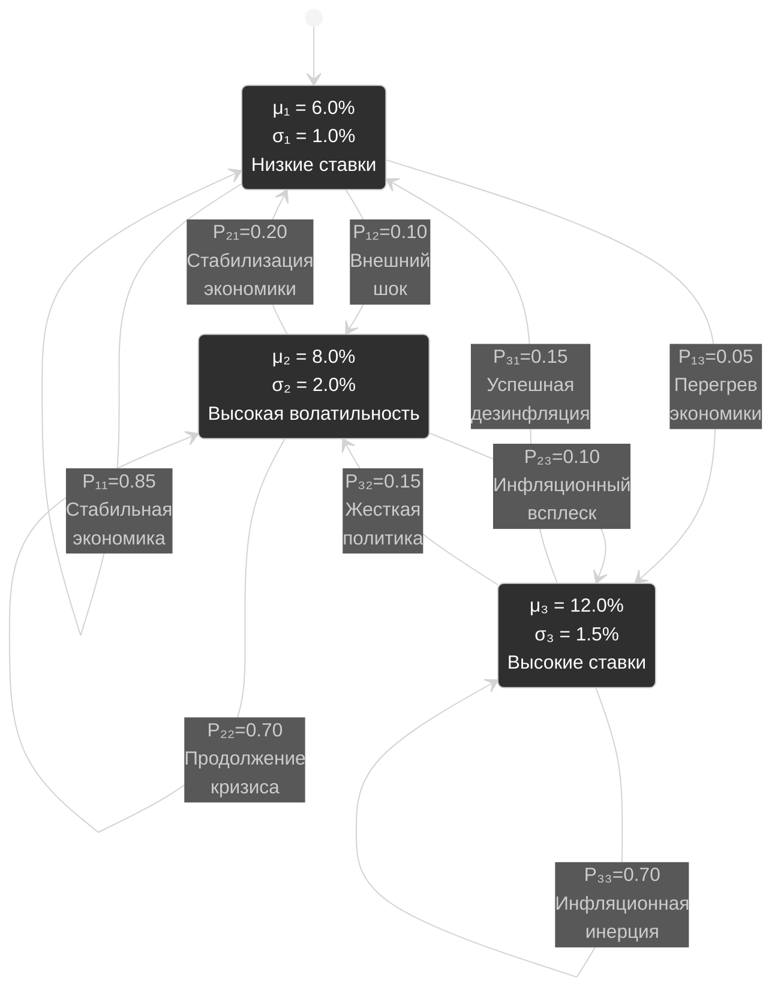
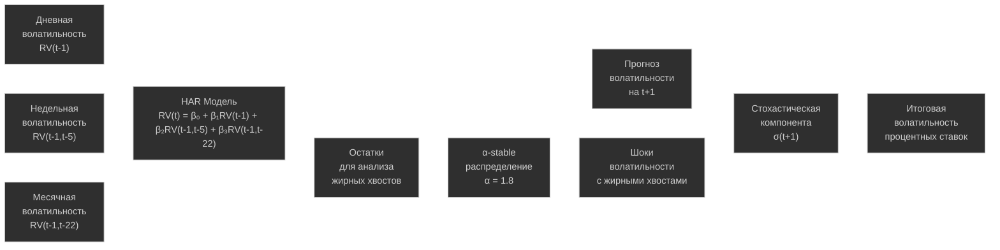

# Стохастическое моделирование процентных ставок ЦБ

Данный проект представляет комплексное исследование стохастического моделирования ключевых процентных ставок центральных банков с применением распределений с жирными хвостами (fat tails). Проект интегрирует современные подходы к анализу tail risks, основанные на исследованиях Fed (2024), BIS, NY Fed и методологии Талеба.

## Быстрый запуск

### Для запуска всего проекта:
```r
# Установка зависимостей и подключение всех библиотек
source("1.R/9.libraries.r")

# Запуск основного скрипта (автоматически подключает все компоненты)
source("1.R/Main.R")
```

### Отдельные компоненты:
- **Все библиотеки:** `source("1.R/9.libraries.r")`
- **Все функции:** `source("1.R/8.SourceAll.R")`
- **Анализ жирных хвостов:** `source("1.R/3.dist_bust.R")`
- **R² коррекция Талеба:** `source("1.R/4.LmR2BoostingStohastic.R")`

### Структура подключений:
```
Main.R
└── 8.SourceAll.R
    ├── 9.libraries.r (все библиотеки)
    ├── HarVolatilityFunctions.R
    ├── HmmFunctions.R
    ├── BoostingFunctions.R
    └── TalebR2Functions.R
```

**Примечание:** Все файлы теперь используют единый источник библиотек `9.libraries.r` для обеспечения совместимости и упрощения управления зависимостями.

## Архитектура системы

Разработанная система представляет собой многоуровневую архитектуру для стохастического моделирования процентных ставок, где каждый компонент решает специфические задачи, но все они интегрированы в единую экосистему:



## Стохастические процессы с жирными хвостами

### Базовая стохастическая дифференциальная модель

В основе нашего подхода лежит расширенное стохастическое дифференциальное уравнение, которое включает несколько типов случайных процессов для более точного моделирования экстремальных событий:

```
dr(t) = μ(r,t)dt + σ(r,t)dW(t) + γ(r,t)dJ(t) + δ(r,t)dN(t)
```

**где:**
- `r(t)` — процентная ставка в момент времени t
- `μ(r,t)` — функция drift (детерминированный тренд)
- `σ(r,t)` — функция диффузии (волатильность)
- `dW(t)` — приращение винеровского процесса (гауссовские шоки)
- `γ(r,t)` — интенсивность α-stable скачков
- `dJ(t)` — приращение α-stable процесса (жирные хвосты)
- `δ(r,t)` — интенсивность пуассоновских шоков
- `dN(t)` — приращение составного пуассоновского процесса (редкие события)



**Drift функция** представляет собой расширенное правило Тейлора: `μ(r,t) = κ(θ(t) - r(t))`, где:
- `κ` — скорость возврата к равновесию
- `θ(t)` — целевая ставка
- `r*` — нейтральная ставка
- `α` — реакция на инфляцию
- `π(t)` — текущая инфляция
- `π*` — цель по инфляции
- `β` — реакция на выпуск
- `y(t)` — текущий выпуск
- `y*` — потенциальный выпуск

**Диффузионная компонента** использует HAR волатильность: `σ(r,t) = σ₀√HAR(t) × √(1 + λ|r(t) - r*|)`, где:
- `σ₀` — базовая волатильность
- `HAR(t)` — гетерогенная авторегрессивная волатильность
- `λ` — параметр нелинейности
- `r(t) - r*` — отклонение от нейтральной ставки

**α-stable скачки** моделируют экстремальные события: `dJ(t) ~ S(α, β, γ, δ)`, где:
- `α = 1.8` — параметр хвостов (1 < α < 2 для жирных хвостов)
- `β = 0` — параметр асимметрии (-1 ≤ β ≤ 1)
- `γ` — параметр масштаба (γ > 0)
- `δ = 0` — параметр сдвига

**Пуассоновские шоки** представляют редкие структурные разрывы: `dN(t) ~ Compound Poisson(λ, F)`, где:
- `λ = 0.05` — интенсивность событий (среднее количество событий в единицу времени)
- `F` — распределение размера скачка

## Режимы денежно-кредитной политики через HMM

Скрытые марковские цепи позволяют моделировать различные режимы экономики, каждый из которых характеризуется своими параметрами процентных ставок:



Математически система описывается матрицей переходов `P = [0.85 0.10 0.05; 0.20 0.70 0.10; 0.15 0.15 0.70]` и вероятностями эмиссии `p(r(t)|S(t)=k) = N(r(t); μₖ, σₖ²)`. 

**Forward-Backward алгоритм:** `α(t,k) = p(r(t)|S(t)=k) × Σⱼ α(t-1,j) × P(j,k)` и `β(t,k) = Σⱼ β(t+1,j) × P(k,j) × p(r(t+1)|S(t+1)=j)`, где:
- `α(t,k)` — прямая вероятность (вероятность наблюдений до момента t и состояния k в момент t)
- `β(t,k)` — обратная вероятность (вероятность наблюдений после момента t при состоянии k в момент t)
- `P(j,k)` — вероятность перехода из состояния j в состояние k
- `p(r(t)|S(t)=k)` — вероятность наблюдения r(t) при состоянии k

Вероятности состояний: `P(S(t)=k|r₁:T) = α(t,k) × β(t,k) / Σⱼ α(t,j) × β(t,j)`

## HAR модели волатильности

Heterogeneous Autoregressive модели учитывают различные временные горизонты участников рынка, что критично для точного прогнозирования волатильности процентных ставок:



Основная модель `RV(t) = β₀ + β₁RV^(d)(t-1) + β₂RV^(w)(t-1) + β₃RV^(m)(t-1) + ε(t)` включает временные компоненты:
- `RV(t)` — реализованная волатильность в момент t
- `β₀` — константа
- `β₁` — коэффициент дневной компоненты
- `RV^(d)(t-1) = RV(t-1)` — дневная волатильность
- `β₂` — коэффициент недельной компоненты  
- `RV^(w)(t-1) = 1/5 × Σᵢ₌₁⁵ RV(t-i+1)` — недельная волатильность (среднее за 5 дней)
- `β₃` — коэффициент месячной компоненты
- `RV^(m)(t-1) = 1/22 × Σᵢ₌₁²² RV(t-i+1)` — месячная волатильность (среднее за 22 дня)
- `ε(t)` — случайная ошибка

Прогнозирование: `RV(t+h) = β₀ + β₁RV^(d)(t+h-1) + β₂RV^(w)(t+h-1) + β₃RV^(m)(t+h-1)`, где h — горизонт прогнозирования.

## Taleb R² коррекция для жирных хвостов

При работе с распределениями с жирными хвостами стандартный R² может давать завышенные оценки качества модели. Методология Талеба предлагает точные формулы коррекции:

**Стандартный R²:** `R²ₛₜd = 1 - SS_res/SS_tot = 1 - Σε²ᵢ/Σ(yᵢ-ȳ)²`, где:
- `SS_res = Σε²ᵢ` — сумма квадратов остатков
- `SS_tot = Σ(yᵢ-ȳ)²` — общая сумма квадратов
- `εᵢ` — остаток для i-го наблюдения
- `yᵢ` — фактическое значение
- `ȳ` — среднее значение

**Taleb точная формула** для t-распределения: `R²ₜₐₗₑᵦ = a²(α-2)/(a²(α-2) + α)`, где:
- `a² = Var(ŷ)/Var(ε)` — отношение дисперсии прогнозов к дисперсии остатков
- `α` — параметр степеней свободы t-распределения
- `E[ε²] = α/(α-2)` — ожидаемая дисперсия для t-распределения при α > 2

**MLE коррекция:** `R²ₘₗₑ = 1 - SS_res × (α/(α-2))/SS_tot`, где:
- `α/(α-2)` — коррекционный множитель для t-распределения

**Shapley декомпозиция** для важности переменных: `R²ₛₕₐₚₗₑy = Σᵢ φᵢ(R²)`, где:
- `φᵢ(R²)` — вклад i-й переменной по Shapley
- `φᵢ(R²) = 1/p! × Σ_S⊆N\{i} [R²(S∪{i}) - R²(S)]`
- `p` — количество переменных
- `S` — подмножество переменных не включающее i
- `N` — множество всех переменных

## Gradient Boosting для выбора распределений

Адаптивный выбор оптимального распределения происходит через градиентный бустинг с функцией потерь `L(θ) = -Σᵢ₌₁ⁿ log p(yᵢ|xᵢ, θ)`, где:
- `L(θ)` — функция потерь (отрицательная логарифмическая правдоподобность)
- `θ` — параметры распределения
- `p(yᵢ|xᵢ, θ)` — плотность вероятности наблюдения yᵢ при заданных xᵢ и θ
- `n` — размер выборки

Обновление весов: `w^(t+1) = w^(t) × exp(-η × ∇L(θ^(t)))`, где:
- `w^(t)` — веса на итерации t
- `η` — скорость обучения
- `∇L(θ^(t))` — градиент функции потерь

Финальная модель: `p(y|x) = Σₖ₌₁ᴷ wₖ × pₖ(y|x, θₖ)`, где:
- `K` — количество распределений {Normal, t-dist, α-stable, GED}
- `wₖ` — вес k-го распределения
- `pₖ(y|x, θₖ)` — k-е распределение с параметрами θₖ

## Метрики качества

**Value at Risk (VaR)** на уровне α: `VaRₐ = inf{x : P(L ≤ x) ≥ α}`, где:
- `L` — потери (убытки)
- `α` — уровень доверия (например, 0.05 для 5%)

**Conditional VaR (Expected Shortfall):** `CVaRₐ = E[L | L ≤ VaRₐ]`, где:
- `E[L | L ≤ VaRₐ]` — условное математическое ожидание потерь при превышении VaR

**Continuous Ranked Probability Score (CRPS)** для непрерывных распределений: 
`CRPS(F,y) = ∫_{-∞}^{∞} (F(x) - 𝟙{x ≥ y})² dx`, где:
- `F(x)` — кумулятивная функция распределения прогноза
- `𝟙{x ≥ y}` — индикаторная функция (1 если x ≥ y, иначе 0)
- `y` — фактическое наблюдение

Для выборочных распределений: `CRPS = 1/n × Σᵢ₌₁ⁿ |xᵢ - y| - 1/(2n²) × Σᵢ₌₁ⁿ Σⱼ₌₁ⁿ |xᵢ - xⱼ|`, где:
- `xᵢ, xⱼ` — элементы прогнозной выборки
- `n` — размер прогнозной выборки

**Probability Integral Transform (PIT):** `PIT = F(y|x)`, где:
- `F` — прогнозное кумулятивное распределение
- `y` — реализованное значение
- Идеальная калибровка: PIT ~ U(0,1) (равномерное распределение)

## Структура проекта

```
CB_models_stohastic/
├── 1.R/
│   ├── 1.functions/
│   │   ├── all_fun.R                    # Все функции проекта
│   │   ├── HarVolatilityFunctions.R     # HAR модели
│   │   ├── HmmFunctions.R               # Скрытые марковские цепи
│   │   ├── BoostingFunctions.R          # Gradient boosting
│   │   └── TalebR2Functions.R           # Методики оценки R²
│   ├── 2.model/
│   │   ├── StochasticTaylorRule.R       # Расширенное правило Тейлора
│   │   └── JumpDiffusionModel.R         # SDE модели
│   ├── 3.dist_bust.R                    # Анализ распределений жирных хвостов
│   ├── 4.LmR2BoostingStohastic.R        # R² коррекция для fat tails
│   ├── 8.SourceAll.R                    # Загрузка всех модулей
│   ├── 9.libraries.r                    # Библиотеки
│   └── Main.R                           # Основной скрипт
├── 2.Cpp/                               # C++ оптимизации
├── 3.Data/                              # Данные ЦБ и макроэкономические
├── 4.CB_models/                         # Модели ЦБ РФ (ДДКП, ДИП)
└── README.md
```

## Методология исследования

### 1. Анализ жирных хвостов (3.dist_bust.R)

**Цель**: Сравнительный анализ распределений с различными типами хвостов

**Методы**:
- Генерация normal, stochastic volatility, mixture распределений
- Tail probability analysis для событий >2σ, >3σ, >4σ, >5σ
- QQ-plots для диагностики нормальности
- Kurtosis и другие моменты для характеристики хвостов

**Результаты**:
- Визуализация различий в хвостах распределений
- Количественная оценка tail risks
- Обоснование необходимости fat-tailed моделей

### 2. R² коррекция для жирных хвостов (4.LmR2BoostingStohastic.R)

**Цель**: Применение методологии Талеба для коррекции R² при fat-tailed residuals

**Методы**:
- **Taleb's exact R² formula**: `R² = a²(α-2)/(a²(α-2) + α)`
- **MLE коррекция**: Учет теоретического `E[ε²] = α/(α-2)`
- **Hill estimator** для оценки параметра α
- Сравнение с standard R² для различных типов residuals

**Результаты**:
- Демонстрация bias в standard R² при fat tails
- Robust оценки для различных типов моделей
- Методики для корректной оценки goodness of fit

### 3. HAR модели волатильности

**Цель**: Прогнозирование волатильности с учетом гетерогенности временных горизонтов

**Модель**:
```
RV(t) = β₀ + β₁RV(t-1) + β₂RV(t-1,t-5) + β₃RV(t-1,t-22) + ε(t)
```

**Компоненты**:
- Daily volatility: RV(t-1)
- Weekly volatility: RV(t-1,t-5)
- Monthly volatility: RV(t-1,t-22)

### 4. Скрытые марковские цепи (HMM)

**Цель**: Моделирование режимов денежно-кредитной политики

**Состояния**:
- S₁: Нормальный режим (низкая волатильность)
- S₂: Кризисный режим (высокая волатильность)
- S₃: Инфляционный режим (агрессивная политика)

**Переходы**:
```
P = [p₁₁ p₁₂ p₁₃]
    [p₂₁ p₂₂ p₂₃]
    [p₃₁ p₃₂ p₃₃]
```

### 5. Gradient Boosting для выбора распределений

**Цель**: Адаптивный выбор оптимального распределения для каждого временного периода

**Алгоритм**:
1. Ensemble из Normal, t-distribution, α-stable, GED
2. Boosting для весов распределений
3. Adaptive distribution selection
4. Cross-validation для robust performance

### 6. Интеграция с моделями ЦБ РФ

#### Расширенное правило Тейлора
Базовое правило дополнено стохастическими компонентами:

```
dr(t) = [α₀ + α₁(π(t) - π*) + α₂(y(t) - y*) + α₃ΔCA(t) + α₄S(t)] dt
      + σ₁ dW(t) + σ₂ dJ(t) + σ₃ dN(t)
```

где:
- `π(t) - π*` — отклонение инфляции от цели
- `y(t) - y*` — разрыв выпуска
- `ΔCA(t)` — динамика цифровых активов
- `S(t)` — санкционные индикаторы
- `dW(t)` — броуновское движение
- `dJ(t)` — α-stable скачки
- `dN(t)` — пуассоновские шоки

#### Нейтральная ставка как стохастический процесс
```
dμ*(t) = κ(E_t[π] - π*) dt + σ_μ dW_μ(t)
```

#### Интеграция данных ЦБ
- Использование моделей ДДКП и ДИП как базовой структуры
- Параметры из `4.CB_models/` для калибровки
- Макроэкономические данные из `3.Data/` для валидации

### 7. Практическое применение

#### Сценарное планирование
- Генерация множественных траекторий процентных ставок
- Stress-testing для экстремальных сценариев
- Оценка tail risks для policy decisions

#### Risk Management
- VaR/CVaR оценки для различных горизонтов
- CRPS и PIT диагностика для model validation
- Tail-sensitive performance metrics

#### Монетарная стратегия
- Adaptive policy rules с учетом режимов
- Robust decision making под неопределенностью
- Integration с существующими моделями ЦБ

### 8. Современные исследования (база для методологии)

#### Tail Risks в центральных банках (2024)

**Fed Research**:
- **Grishchenko & Wilcox (May 2024)**: "Tale About Inflation Tails" - state-space модели для extreme inflation events
- **NY Fed (July 2024)**: ZLB risk analysis - 9% вероятность ZLB на 7-летнем горизонте

**BIS Research**:
- **Heterogeneous agent New Keynesian models** с ZLB constraints
- **Neural network solutions** для сложных DSGE моделей

**St. Louis Fed**:
- **Kozlowski (July 2024)**: Inflation tail risks через financial market data
- Переход от left-tail к right-tail рискам post-pandemic

#### Ограничения α-stable распределений

**Текущее состояние**:
- Ограниченное применение в operational моделях ЦБ
- Фокус на tail risks в inflation expectations, а не в процентных ставках
- Доминирование traditional diffusion/jump-diffusion процессов

**Возможности**:
- Растущий интерес к hybrid monetary systems
- Необходимость модернизации стохастических моделей
- Потенциал для innovative approaches

**Результат**: Получился современный, адаптивный фреймворк для моделирования процентных ставок ЦБ, способный обрабатывать как обычные колебания, так и экстремальные события, обеспечивая высокоточную поддержку денежно-кредитной политики в условиях структурной неопределенности.
