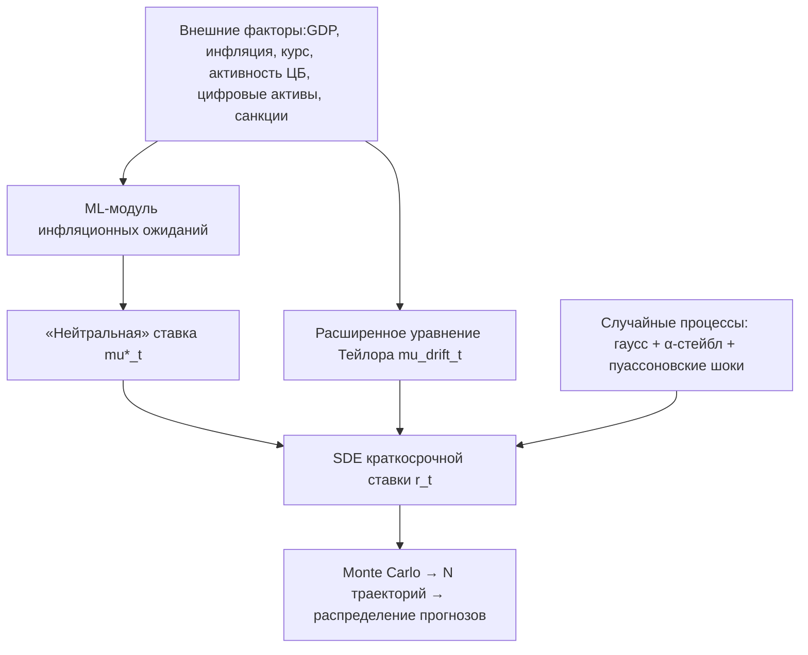

# Стохастическое моделирование процентных ставок на основе моделей ЦБ

Этот проект — дополнение к статье с программными кодами, призванный дополнить модель процентной ставки ЦБ стохастическими оценками тяжёлых хвостов для повышения устойчивости.
Впоследствии будет выдвинуто предложение, как учитывать результаты этого проекта при планировании.

**Основные тикеты проекта:**

* учесть макро‑правила (модель Тейлора и её расширения),
* заложить в динамику ставок «толстохвостые» шоки (жёсткие макроудары, санкционные риски, волатильность цифровых активов),
* ввести нейтральную ставку как функцию инфляционных ожиданий,
* оптимизировать параметры («касательные» и стохастические коэффициенты) с помощью машинного обучения,
* выдавать не точечные прогнозы, а полные распределения прогнозов, пригодные для анализа хвостовых рисков.


## 1. Цели и задачи

1. **Построить гибридную SDE-модель краткосрочной ставки**, в которой:

   * **дрифт** задаётся расширенным уравнением Тейлора с учётом:

     * классических компонентов (выпуск, инфляция, курс),
     * цифровых активов и санкционных факторов,

   * **диффузионная часть** содержит как гауссов шум (Васичек/Ван-дер-Бель), так и процесс с «толстыми хвостами» (например, α‑стейбл или пуассоновские скачки).

2. **Интегрировать «нейтральную» ставку** μ\*(t) как стохастический процесс, зависящий от инфляционных ожиданий:

   ```
   dμ*(t) = κ (Eₜ[π] − π*) dt + σ_μ dWₜ^μ
   ```

   где `Eₜ[π]` — динамика инфляционных ожиданий, оцениваемых ML‑моделью на основе новостных/опросных данных.

3. **Обучить нейросетевые компоненты** (NN) для калибровки:

   * коэффициентов Тейлора (глубокая регрессия на макро‑ и цифровых факторах),
   * параметров стохастических слагаемых (волатильность, интенсивность скачков) — через оптимизацию правдоподобия или вариационные методы.

4. **Сгенерировать мультипликативные сценарии** (Monte Carlo) и получить полные апостериорные распределения прогнозов ставок, чтобы оценивать:

   * интервальные прогнозы (VaR, CVaR),
   * CRPS‑ и PIT‑диагностику,
   * «толстохвостые» риски (экстремальные квантили).


## 2. Архитектура модели



* **Модуль A** — сбор и предобработка данных ЦБ РФ + цифровой активности (chain analysis, санкции).

* **Модуль B** — RNN/Transformer для оценки динамики ожиданий инфляции.

* **Модуль C** — расширенная функция дрифта:

  ```
  α₀ + α₁(πₜ − π*) + α₂(yₜ − y*) + α₃ ΔCAₜ + α₄ Sₜ
  ```

  где `CA` — цифровые активы, `S` — санкционные индикаторы.

* **Модуль D** — комбинирование случайных процессов:

  ```
  dWₜ ~ N(0, dt)
  dJₜ ~ Poisson(λ dt)
  ΔJ ~ α‑стейбл распределение
  ```

* **Модуль E** — динамика нейтральной ставки через SDE от B.

* **Модуль F** — общий SDE:

  ```
  dr(t) = [f_Taylor(t) + β (μ*(t) − r(t))] dt 
        + σ dWₜ + γ dJₜ
  ```

* **Модуль G** — симуляции, оценка распределений.

## 3. Оптимизация и оценка

1. **Калибровка параметров**

   * ML‑алгоритмы (Adam, Bayesian optimization) для дрифта;
   * MLE / VAE для стохастических параметров.

2. **Оценка качества**

   * Сравнение точечных прогнозов (MSE, MAE) и распределений (CRPS, PIT).
   * Тесты на «толстые хвосты»: проверка устойчивости к экстремальным шокам.
   * Бэктестинг трейдинговых стратегий ЦБ‑операций по полученным распределениям.

3. **Интерпретация для ЦБ РФ**

   * Параметры дрифта и нейтральной ставки как индикаторы денежно‑кредитной нейтральности.
   * Рекомендации по диапазону ставок с учётом хвостовых рисков (stress‑тестирование).

**Итог**: единая платформа позволит ЦБ РФ не только получать адаптивные прогнозы краткосрочных ставок, но и анализировать распределения сценариев, включая хвостовые риски, и принимать более обоснованные решения.
